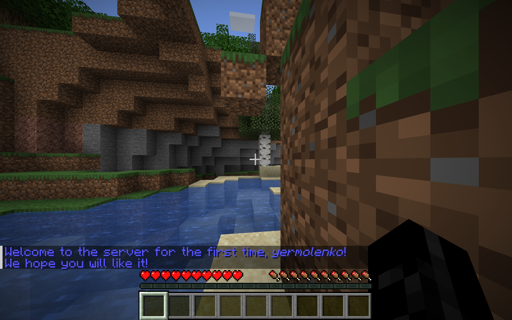
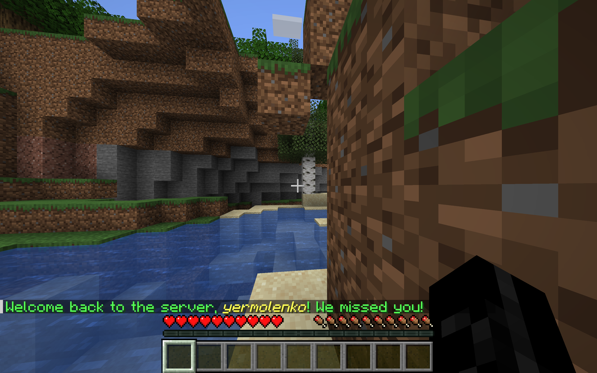

# JoinQuitPlugin

A Minecraft plugin that handles player join and quit events. This plugin is designed to enhance the player experience by providing custom messages when players join or leave the server.

## Screenshots

## Features

- Custom join message when a player joins the server.
- Custom quit message when a player leaves the server.
- Easy-to-configure with support for multilingual messages.

## Installation

1. Download the latest version of the plugin.
2. Place the `JoinQuitPlugin.jar` file in the `plugins` folder of your Minecraft server.
3. Restart or reload your server.

## Configuration

1. Navigate to the `config.yml` file in the plugin's folder.
2. Modify the join and quit messages as needed.
3. You can also customize the messages for specific player ranks or groups.

## Usage

- When a player joins the server, a custom message will be displayed to all online players.
- When a player quits, a custom message will be displayed to all online players.

### Example Messages

- Join Message: `"Welcome, {player}! Enjoy your stay!"`
- Quit Message: `"Goodbye, {player}! See you soon!"`

## License

This project is licensed under the MIT License - see the [LICENSE](LICENSE) file for details.
